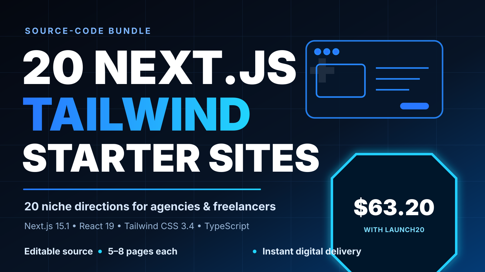

# 20 Next.js Templates for Agencies & Freelancers

> **Next.js 15.1 + React 19 + Tailwind CSS 3.4 + TypeScript** — 20 multi-page starter sites designed for agency pitches and client builds.  
> Skip the blank canvas, show a credible first direction sooner, then spend your time on the client’s brand, content, and experience. **All demo client names, testimonials, metrics, awards, availability claims, phone numbers, and email addresses are fictional placeholders—not product results or endorsements.** Forms and commerce/booking actions are demo UI flows; replace all placeholders, connect a production backend, and test it before client delivery.

**[Review all 20 demos, scope and limitations →](https://cekuu35.github.io/india-nextjs-templates/?utm_source=github&utm_medium=referral&utm_campaign=india_launch)** · **[Get all 20 for $63.20 with LAUNCH20 → Gumroad](https://cengokurtoglu.gumroad.com/l/vuhstz/LAUNCH20?wanted=true&utm_source=github&utm_medium=referral&utm_campaign=india_launch)**

> **Launch offer:** LAUNCH20 currently applies 20% off the $79 USD list price when Gumroad accepts the code. Gumroad checkout is the source of truth for code validity, final price, taxes, conversion, and payment methods.

**Not seeing the right client niche? [Request a starting point](https://github.com/cekuu35/nextjs-website-templates/issues/new?template=niche-request.yml) — no purchase or private client details required.**

**Questions before buying? [Ask in the public pre-purchase thread](https://github.com/cekuu35/nextjs-website-templates/issues/2) — please do not post private client information.**

---

## What's Inside

Every template includes:

- **Multi-page structure** (5–8 pages per template)
- **Demo form flows** — contact, booking, reservation, and registration interfaces; production submission requires your own backend or form service
- **Next.js 15.1 App Router** — adaptable starter architecture
- **React 19 + Tailwind CSS 3.4** — responsive interface foundations
- **TypeScript** — editable source included
- **Demo content and assets** — replace names, claims, images, contact details, legal copy, pricing, and policies before client use
- **next/image** optimized assets, **next/font** for fonts

---

## Next.js website templates for agencies — not a SaaS boilerplate

This bundle is for freelancers and agencies that need **multiple client-facing visual starting points** across different industries. It is not positioned as an auth, billing, database, or subscription backend.

- Choose from 20 niche-specific multi-page directions instead of adapting one generic landing page to every brief.
- Use the live demos to discuss a visual direction, then replace all placeholder content and connect the production services the client actually needs.
- Pick a full-stack SaaS boilerplate instead if your main requirement is prebuilt authentication, billing, database, or application logic.

**[Compare the 20 live directions and open the verified $63.20 LAUNCH20 checkout →](https://cengokurtoglu.gumroad.com/l/vuhstz/LAUNCH20?wanted=true&utm_source=github&utm_medium=referral&utm_campaign=india_launch_comparison)**

---

## Bundle vs. a single template vs. a SaaS boilerplate

Choose by the work you need to start—not by the longest feature list.

| Starting point | Best fit | What you still need to do |
|---|---|---|
| **This 20-template bundle ($63.20 with LAUNCH20; normally $79)** | Agencies and freelancers who want multiple niche-specific visual directions for pitches and marketing-site builds | Replace all demo content, apply the client brand, connect production services, and test the finished site |
| **One premium template** | A single project whose niche and visual direction are already settled | Adapt that design to the client and complete production integrations |
| **A full-stack SaaS boilerplate** | Products that need prebuilt auth, billing, database, teams, or application logic | Build the product-specific workflows, UI, and operational setup |

The bundle is the practical fit when **breadth of client-facing starting points** matters more than prebuilt backend infrastructure.

**[Review the included directions and get all 20 for $63.20 with LAUNCH20 →](https://cengokurtoglu.gumroad.com/l/vuhstz/LAUNCH20?wanted=true&utm_source=github&utm_medium=referral&utm_campaign=india_launch_alternatives)**

---

## All 20 Templates

### SaaS & Tech

| Template | Niche | Live Demo | Pages |
|----------|-------|-----------|-------|
| **Modern SaaS** | SaaS / Software | [Live Demo](https://01-modern-saas.vercel.app) | Home, Features, Pricing, Integrations, Blog, Contact |
| **AI Startup** | AI / Machine Learning | [Live Demo](https://02-ai-startup.vercel.app) | Home, Features, Pricing, About, Blog, Contact |
| **Mobile App Promo** | App Landing / SaaS | [Live Demo](https://15-mobile-app.vercel.app) | Home, Features, How It Works, Pricing, Download |

### Agency & Portfolio

| Template | Niche | Live Demo | Pages |
|----------|-------|-----------|-------|
| **Digital Agency** | Agency / Creative | [Live Demo](https://03-digital-agency.vercel.app) | Home, Services, Work/Case Studies, About, Contact |
| **Photography Portfolio** | Photography | [Live Demo](https://12-photography-portfolio.vercel.app) | Home, Gallery (categorized), About, Packages, Booking |
| **Personal CV** | Portfolio / Resume | [Live Demo](https://free-nextjs-cv-template.vercel.app) | Home, About/Resume, Projects, Blog, Contact |

### Food & Hospitality

| Template | Niche | Live Demo | Pages |
|----------|-------|-----------|-------|
| **Restaurant & Cafe** | Restaurant / Cafe | [Live Demo](https://04-restaurant-cafe.vercel.app) | Home, Menu (categorized), Gallery, About, Reservation |
| **Restaurant Reservation** | Fine Dining | [Live Demo](https://10-restaurant-reservation.vercel.app) | Home, Menu, Reservation (with ref no.), About, Contact |
| **Hotel Booking** | Hotel / Hospitality | [Live Demo](https://17-hotel-booking.vercel.app) | Home, Rooms (list + detail), Amenities, Gallery, Booking |

### Health & Wellness

| Template | Niche | Live Demo | Pages |
|----------|-------|-----------|-------|
| **Fitness & Gym** | Gym / Sports | [Live Demo](https://06-fitness-gym.vercel.app) | Home, Classes, Schedule, Trainers, Membership, Contact |
| **Dental Clinic** | Healthcare / Medical | [Live Demo](https://09-dental-clinic.vercel.app) | Home, Treatments (+ detail), Team, About, Appointment |
| **Barber & Salon** | Beauty / Grooming | [Live Demo](https://11-barber-salon.vercel.app) | Home, Services (priced), Gallery, Team, Booking |

### Business & Professional

| Template | Niche | Live Demo | Pages |
|----------|-------|-----------|-------|
| **Real Estate** | Property / Listings | [Live Demo](https://05-real-estate.vercel.app) | Home, Listings (filterable), Listing Detail, About, Inquiry |
| **Construction** | Construction / B2B | [Live Demo](https://18-construction.vercel.app) | Home, Services, Projects (+ detail), About, Quote |
| **Law Firm** | Legal / Professional | [Live Demo](https://19-law-firm.vercel.app) | Home, Practice Areas (+ detail), Attorneys, About, Consultation |

### Education & Content

| Template | Niche | Live Demo | Pages |
|----------|-------|-----------|-------|
| **Online Course** | Education / eLearning | [Live Demo](https://08-online-course.vercel.app) | Home, Courses (list + detail/curriculum), Instructor, Pricing, Contact |
| **Newsletter & Creator** | Content / Media | [Live Demo](https://16-newsletter-creator.vercel.app) | Home, Features, Pricing, Sample Issues, Subscribe/Contact |

### E-Commerce & Events

| Template | Niche | Live Demo | Pages |
|----------|-------|-----------|-------|
| **E-Commerce Store** | Retail / Shopping | [Live Demo](https://07-ecommerce-store.vercel.app) | Home, Products (filter+sort), Product Detail, Cart, About, Contact |
| **Event & Conference** | Events / Ticketing | [Live Demo](https://13-event-conference.vercel.app) | Home, Agenda, Speakers (+ detail), Tickets, Registration |

### Emerging Tech

| Template | Niche | Live Demo | Pages |
|----------|-------|-----------|-------|
| **Web3 & Crypto** | Blockchain / Web3 | [Live Demo](https://14-web3-crypto.vercel.app) | Home, Product/Features, Tokenomics, Roadmap, FAQ |

---

## Pricing

**All 20 templates: $63.20 USD with LAUNCH20 (normally $79).** The verified checkout delivers one 17.7 MB ZIP with the editable source folders. Confirm the current license scope and final amount in Gumroad before purchase.

**[Preview all 20 demos →](https://cekuu35.github.io/india-nextjs-templates/?utm_source=github&utm_medium=referral&utm_campaign=india_launch_pricing)** · **[Get all 20 for $63.20 with LAUNCH20 →](https://cengokurtoglu.gumroad.com/l/vuhstz/LAUNCH20?wanted=true&utm_source=github&utm_medium=referral&utm_campaign=india_launch_pricing)** · **[Read the buyer guide](BUYER_GUIDE.md)**

---

## Free Template

Want to try before you buy?

**[free-nextjs-cv-template](https://github.com/cekuu35/free-nextjs-cv-template)** — A free Next.js 15 personal CV/portfolio template. Multi-page, Tailwind CSS, TypeScript, Vercel-ready. No login, no email required.

---

## Tech Stack

---

## FAQ

**Q: Is source code included?**  
A: The inspected [$63.20 LAUNCH20 checkout](https://cengokurtoglu.gumroad.com/l/vuhstz/LAUNCH20?wanted=true&utm_source=github&utm_medium=referral&utm_campaign=india_launch_faq) currently delivers one 17.7 MB ZIP containing the editable source folders when Gumroad accepts the code.

**Q: Do I need a backend?**  
A: The included forms are demo interfaces. Connect a real backend or form service such as Resend before production, then test validation, delivery, spam protection, consent, and error handling.

**Q: Can I use this for client work?**  
A: The bundle is intended as editable source for agency and freelance workflows, but the current public checkout does not state commercial-use or redistribution terms. Confirm those rights with the seller before purchase and before client delivery.

**Q: Next.js version?**  
A: The currently inspected bundle sources use **Next.js 15.1, React 19, and Tailwind CSS 3.4**. Check the checkout and included README files for the exact version delivered with your purchase.

---

## Machine-readable product data

Search engines, directories, and AI agents can read the current verified offer in [`product.json`](product.json): **20 templates, $63.20 USD with LAUNCH20 (normally $79), direct Gumroad checkout, no subscription**.

---

*This repository is a marketing showcase. [Get the full source bundle for $63.20 with LAUNCH20 on Gumroad](https://cengokurtoglu.gumroad.com/l/vuhstz/LAUNCH20?wanted=true&utm_source=github&utm_medium=referral&utm_campaign=india_launch_footer) while Gumroad accepts the code.*
